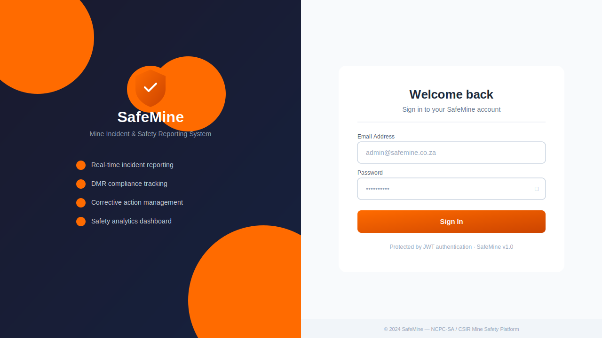
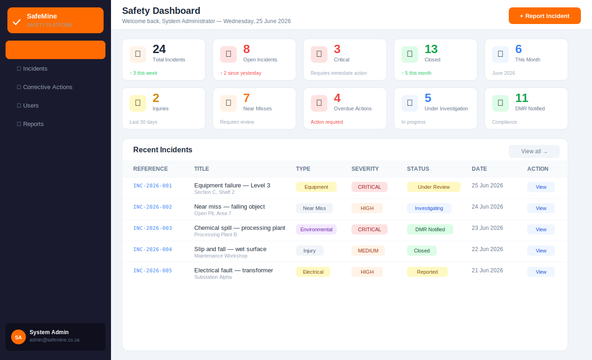
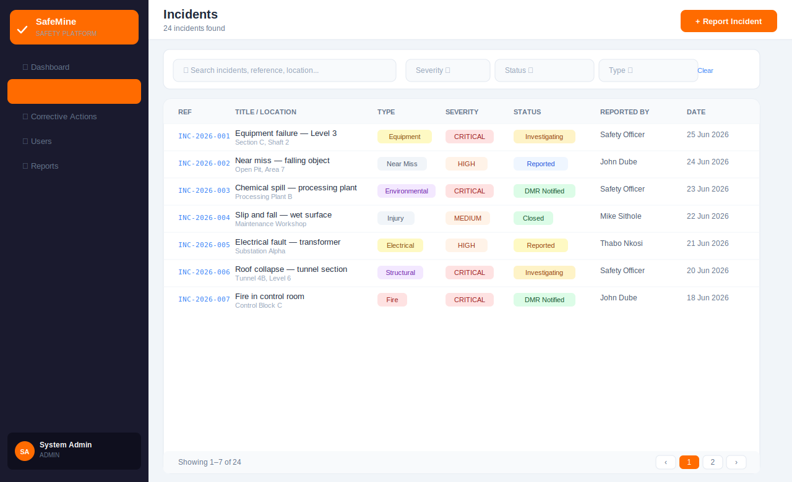
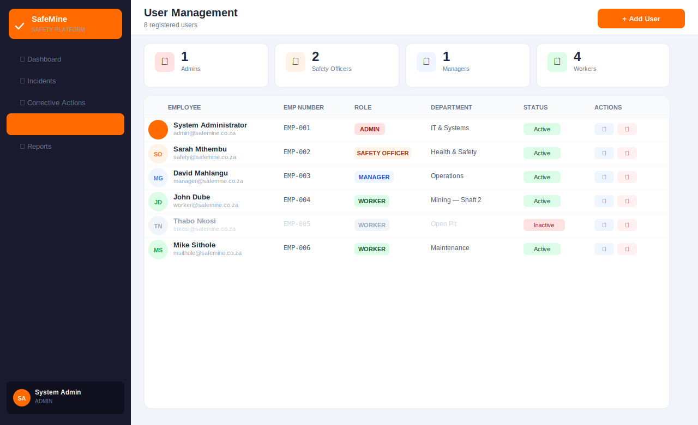
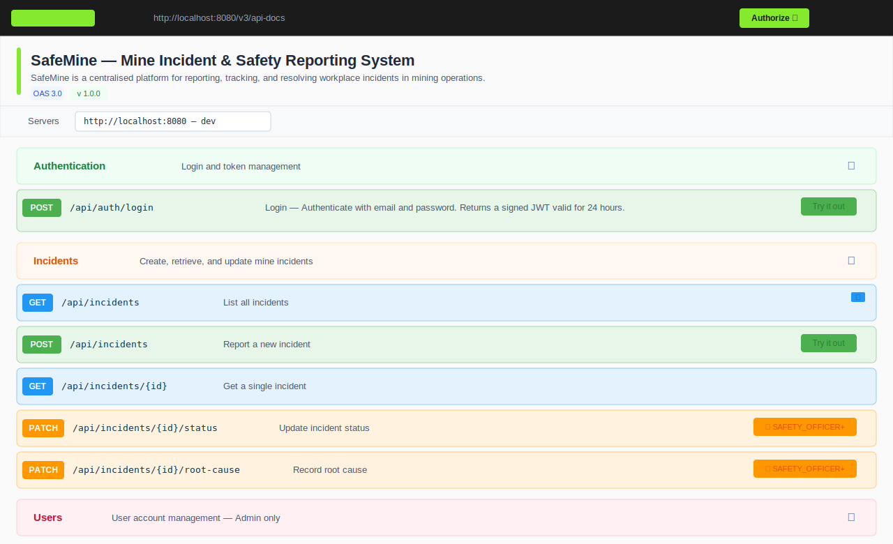

<div align="center">
  
  <h1>SafeMine — Mine Incident &amp; Safety Reporting System</h1>
  <p>Full-stack mine safety platform · Spring Boot 3.2 · Angular 17 · JWT · DMR Compliance</p>

  
  
  
  
</div>

---

## Screenshots

### Login


### Safety Dashboard


### Incident Management


### User Management


### Swagger API Docs


---

## Features

| Module | Description |
|--------|-------------|
| **Incident Reporting** | Any authenticated user can report incidents with type, severity, location, and injury details |
| **Status Workflow** | `REPORTED` → `UNDER_INVESTIGATION` → `RESOLVED` → `CLOSED` → `DMR_NOTIFIED` |
| **Root Cause Analysis** | Safety officers document root cause findings per incident |
| **Dashboard KPIs** | Real-time counts — open, critical, injuries, near-misses, overdue actions |
| **User Management** | Admin creates/deactivates user accounts across all roles |
| **DMR Compliance** | Track Department of Mineral Resources notification status |
| **Role-based Access** | Fine-grained `@PreAuthorize` on every endpoint |
| **JWT Security** | Spring Security 6 + HS256 JWT, 24 h expiry |
| **Swagger UI** | Full OpenAPI 3.0 docs at `/swagger-ui.html` |

---

## Tech Stack

**Backend**

- Java 17 · Spring Boot 3.2
- Spring Security 6 (JWT + method-level `@PreAuthorize`)
- Spring Data JPA · H2 (dev) · PostgreSQL (prod)
- springdoc-openapi 2.3 (Swagger UI)
- Lombok · Maven

**Frontend**

- Angular 17 (standalone components)
- Angular Material UI
- RxJS · JWT interceptor

---

## Getting Started

### Prerequisites

- Java 17+
- Maven 3.9+
- Node 20+ / npm

### Backend

```bash
cd backend
mvn spring-boot:run
```

- REST API → `http://localhost:8080`
- Swagger UI → `http://localhost:8080/swagger-ui.html`
- H2 Console → `http://localhost:8080/h2-console`

### Frontend

```bash
cd frontend
npm install
ng serve
```

- App → `http://localhost:4200`

---

## Default Credentials

Seeded automatically on first run:

| Role | Email | Password |
|------|-------|----------|
| Admin | admin@safemine.co.za | `Admin@123` |
| Safety Officer | safety@safemine.co.za | `Safety@123` |
| Worker | worker@safemine.co.za | `Worker@123` |

---

## API Overview

All endpoints except `POST /api/auth/login` require a `Bearer <token>` header.

| Method | Endpoint | Role |
|--------|----------|------|
| `POST` | `/api/auth/login` | Public |
| `GET` | `/api/incidents` | All |
| `POST` | `/api/incidents` | All |
| `GET` | `/api/incidents/{id}` | All |
| `PATCH` | `/api/incidents/{id}/status` | Safety Officer, Manager, Admin |
| `PATCH` | `/api/incidents/{id}/root-cause` | Safety Officer, Manager, Admin |
| `GET` | `/api/dashboard/stats` | All |
| `GET` | `/api/users` | Safety Officer, Manager, Admin |
| `POST` | `/api/users` | Admin |
| `PUT` | `/api/users/{id}` | Admin |
| `PATCH` | `/api/users/{id}/toggle-status` | Admin |
| `DELETE` | `/api/users/{id}` | Admin |

Full interactive docs: **`http://localhost:8080/swagger-ui.html`**

---

## Project Structure

```
incident-safety-reporting-system/
├── logo.svg
├── backend/
│   └── src/main/java/com/mining/safety/
│       ├── config/          # SecurityConfig, SwaggerConfig, EncoderConfig
│       ├── controller/      # AuthController, IncidentController, UserController, DashboardController
│       ├── dto/             # Request/response DTOs
│       ├── entity/          # User, Incident JPA entities
│       ├── enums/           # Role, IncidentType, Severity, IncidentStatus
│       ├── repository/      # Spring Data JPA repositories
│       ├── security/        # JwtAuthFilter, JwtService, UserDetailsServiceImpl
│       └── service/         # AuthService, IncidentService, UserService
└── frontend/
    └── src/app/
        ├── core/            # AuthService, AuthGuard, JWT interceptor
        ├── models/          # TypeScript interfaces
        ├── pages/
        │   ├── login/
        │   ├── dashboard/
        │   ├── incidents/   # list, form, detail
        │   ├── users/
        │   └── reports/
        └── shared/          # Layout, sidebar, topbar
```

---

## Production Deployment

1. Switch `application.properties` to PostgreSQL:

```properties
spring.datasource.url=jdbc:postgresql://localhost:5432/safemine
spring.datasource.username=postgres
spring.datasource.password=yourpassword
spring.jpa.database-platform=org.hibernate.dialect.PostgreSQLDialect
```

2. Set a strong JWT secret:

```properties
app.jwt.secret=<minimum-32-char-random-string>
```

3. Update CORS to your frontend domain:

```properties
app.cors.allowed-origins=https://your-frontend-domain.com
```

4. Build:

```bash
mvn clean package -DskipTests
ng build --configuration production
```

---

<div align="center">
  <sub>Built with ❤️ for mine safety· SafeMine v1.0</sub>
</div>
